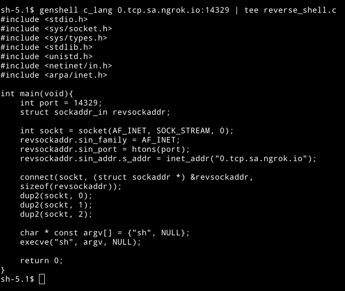

# genshell
> Generate reverse shells from the terminal. 


## Usage: 
``` 
genshell 192.168.1.10:1024 
genshell bash_i 192.168.1.10:1024
genshell --shell zsh -e bash_i 192.168.1.10:1024
``` 

## Instalation (ELF)
```
sudo curl https://raw.githubusercontent.com/entr0pie/genshell/main/genshell.conf > /etc/genshell.conf
wget https://raw.githubusercontent.com/entr0pie/genshell/main/genshell && sudo cp genshell /bin/genshell
```

## Compiling from source
``` 
git clone https://github.com/entr0pie/genshell.git
cd genshell
go build genshell.go
sudo cp genshell.conf /etc/genshell.conf && sudo cp genshell /bin/genshell
```

## TODO's 

- [ ] Add classe to the executers (like python3.short.singlequotes)
- [ ] Add more executers
